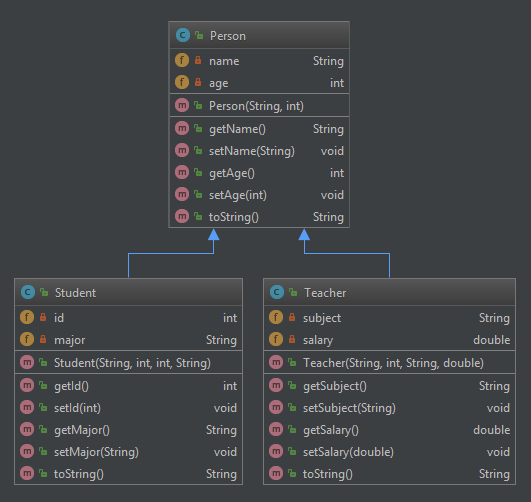

# Lab 4: Inheritance and Polymorphism

## Tasks

In this lab, there are three classes: `Person`, `Student`, and `Teacher`. The following class diagram shows the members in them and the inheritance relationship between them.
Your task is to complete the three classes according to the diagram below by implementing the corresponding constructors and methods. In this diagram, the members with a green open lock are public, and those with a red lock are private.  You may verify your implementation by running the provided test cases similar to previous labs.

  

Please note that you should implement the `toString()` method in a way that the method returns a string containing the simple name of the class and the name of the person.

## Submission

You should submit a **zipped** file of the project code to Canvas. We will import your project and test the code. Remember to run the test cases to check your implementation before submission. To run the test cases, you should use a terminal, go to your project's directory and run the command `./gradlew test`.
 
The deadline is March 16, 2024, 23:59:59 HKT.
